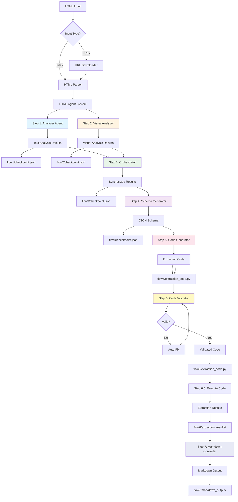
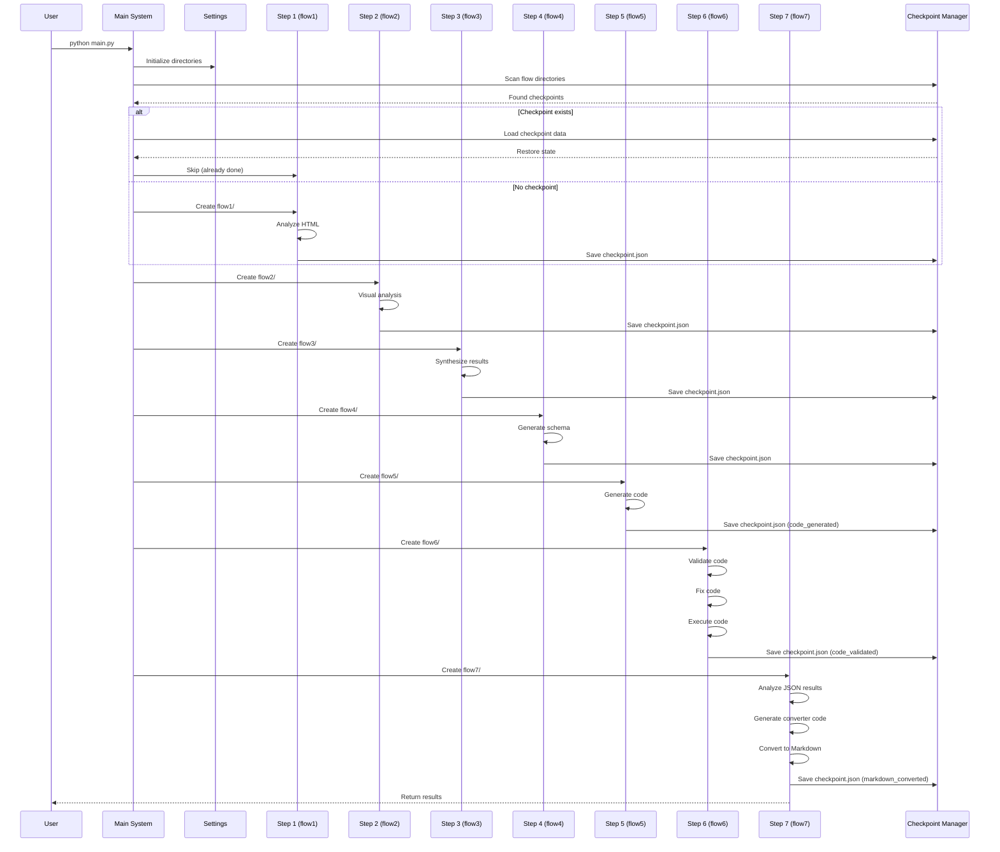
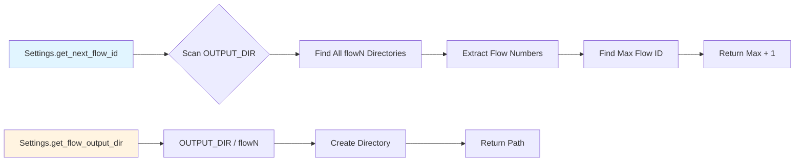

<div align="center">

# 🤖 crawlAgent

### Intelligent HTML Extraction Agent System

[](https://www.python.org/)
[](LICENSE)
[](https://openai.com/)
[](https://anthropic.com/)

**Automatically parse HTML, generate extraction schemas, and produce production-ready code using AI agents.**

[Features](#-features) • [Quick Start](#-quick-start) • [Architecture](#-architecture) • [Documentation](#-documentation) • [Examples](#-examples)

</div>

---

## 📖 Overview

**crawlAgent** is an intelligent HTML extraction agent that uses specialized AI agents to automatically parse, understand, and extract structured data from HTML documents. Instead of manually writing XPath selectors or CSS queries, the system intelligently analyzes HTML structures, identifies content patterns, and generates production-ready extraction code.

### 🎯 What Makes It Special?

- **🧠 Intelligent Understanding**: AI agents understand HTML semantics, not just syntax
- **🔄 Multi-Agent Collaboration**: Four specialized agents work together seamlessly
- **📊 Pattern Recognition**: Automatically identifies common patterns across multiple pages
- **🛠️ Production-Ready**: Generates robust, maintainable extraction code
- **⚡ Smart Checkpointing**: Resume from any step, never lose progress

---

## ✨ Features

### 🤖 Multi-Agent Architecture

| Agent | Purpose | Model |
|-------|---------|-------|
| **🔍 Analyzer Agent** | Deep text-based HTML structure analysis | Claude/OpenAI |
| **👁️ Visual Analyzer** | Visual layout analysis using vision models | GPT-4 Vision |
| **🎯 Orchestrator** | Coordinates agents and synthesizes results | GPT-4 |
| **💻 Code Generator** | Generates production-ready extraction code | GPT-4 |
| **✅ Code Validator** | Validates and improves code quality | GPT-4/Claude |
| **📝 Markdown Converter** | Converts JSON results to Markdown format | GPT-4/Claude |

### 🧠 Intelligent Parsing

- **Multi-Modal Analysis**: Combines text (LLM) and visual (Vision) analysis
- **Automatic XPath Generation**: Intelligently generates XPath expressions
- **Schema Inference**: Creates JSON schemas from HTML structure
- **Pattern Recognition**: Identifies common patterns across multiple files

### ⚡ Automation & Efficiency

- **Batch Processing**: Analyze multiple HTML files simultaneously
- **URL Download**: Automatically download HTML from URL lists
- **Checkpoint System**: Save progress and resume from interruptions
- **Step-by-Step Results**: Review intermediate results at each step

### 🛠️ Developer Experience

- **Beautiful Logging**: Colored console output with file logging
- **Custom API Endpoints**: Support for OpenAI-compatible APIs
- **Error Recovery**: Automatic retry and fallback mechanisms
- **Code Validation**: Automatic syntax and robustness checking

---

## 🚀 Quick Start

### Installation

```bash
# Clone the repository
git clone https://github.com/SHUzhangshuo/crawlAgent
cd crawlAgent

# Install dependencies
pip install -r requirements.txt

# Install Playwright browsers (for visual analysis)
playwright install chromium
```

### Configuration

1. **Copy the example environment file:**
   ```bash
   cp env.example .env
   ```

2. **Edit `.env` and add your API keys:**
   ```env
   # OpenAI API (for orchestrator and code generator)
   OPENAI_API_KEY=sk-your_api_key_here
   OPENAI_API_BASE=http://your-endpoint:port/v1
   OPENAI_MODEL=gpt-4o-mini

   # Anthropic API (for analyzer)
   ANTHROPIC_API_KEY=your_anthropic_api_key_here
   ANTHROPIC_BASE_URL=https://api.anthropic.com
   ANTHROPIC_MODEL=claude-3-5-sonnet-20241022

   # Vision Model API (for visual analysis)
   VISION_API_KEY=sk-your_api_key_here
   VISION_MODEL=gpt-4o
   VISION_API_BASE=http://your-endpoint:port/v1
   ```

### Basic Usage

```bash
# Use default configuration (auto-read from spread directory, auto-create new flow directory)
python main.py

# Use typical directory (learning content)
python main.py --input-type typical

# Process specified URL list file
python main.py urls.txt

# Process specified HTML directory
python main.py ./html_files

# Disable visual analysis (faster)
python main.py --no-visual

# Specify flow ID (disable auto-increment)
python main.py --flow-id 1

# Specify custom output directory
python main.py --output-dir ./results
```

### Using the Generated Code

After processing, use the generated extraction code:

```python
from output.extraction_code import HTMLExtractor
import json

# Create extractor
extractor = HTMLExtractor()

# Extract from file
result = extractor.extract(file_path="example.html")
print(json.dumps(result, indent=2, ensure_ascii=False))

# Extract from HTML string
html_string = "<html><body><h1>Title</h1></body></html>"
result = extractor.extract(html_content=html_string)

# Batch processing
from pathlib import Path
files = list(Path("html_files").glob("*.html"))
results = extractor.extract_batch(files, is_file_paths=True)
```

---

## 🏗️ Architecture

### System Architecture Diagram



### Multi-Agent Workflow

```
HTML Input (Files/URLs)
    ↓
[Agent 1] Analyzer Agent
    ├─ Text Structure Analysis
    ├─ XPath Generation
    └─ Pattern Identification
    ↓
[Agent 2] Visual Analyzer (Optional)
    ├─ HTML Rendering (Playwright)
    ├─ Visual Layout Analysis
    └─ Content Region Detection
    ↓
[Agent 3] Orchestrator
    ├─ Synthesize Results
    ├─ Identify Common Patterns
    └─ Generate JSON Schema
    ↓
[Agent 4] Code Generator
    ├─ Generate Python Code
    └─ Implement Error Handling
    ↓
[Agent 5] Code Validator
    ├─ Syntax Validation
    ├─ Robustness Checking
    └─ Auto-Fix Issues
    ↓
[Step 6.5] Code Execution
    ├─ Execute on spread directory
    └─ Generate JSON results
    ↓
[Agent 6] Markdown Converter
    ├─ Analyze JSON content fields
    ├─ Generate converter code
    └─ Convert to Markdown format
    ↓
Production-Ready Code + Schema + Markdown
```

### Processing Steps with Flow Directories



### Processing Steps

1. **Text Analysis** → Analyzer Agent analyzes HTML structure → `flow1/`
2. **Visual Analysis** → Visual Analyzer analyzes rendered layout (optional) → `flow2/`
3. **Coordination** → Orchestrator synthesizes all results → `flow3/`
4. **Schema Generation** → Orchestrator generates JSON schema → `flow4/`
5. **Code Generation** → Code Generator creates extraction code → `flow5/`
6. **Code Validation** → Code Validator validates and improves code → `flow6/`
7. **Code Execution** → Execute validated code on spread directory → `flow6/extraction_results/`
8. **Markdown Conversion** → Markdown Converter analyzes JSON and generates converter code → `flow7/`

---

## 📁 Project Structure

```
crawlAgent/
├── agents/                  # AI Agent implementations
│   ├── orchestrator.py      # Orchestrator agent
│   ├── analyzer.py          # Analyzer agent
│   ├── code_generator.py    # Code generator agent
│   └── code_validator.py    # Code validator agent
├── utils/                   # Utility modules
│   ├── html_parser.py       # HTML parsing utilities
│   ├── visual_analyzer.py   # Visual analysis
│   ├── url_downloader.py    # URL downloading
│   ├── logger.py            # Logging system
│   └── checkpoint.py        # Checkpoint management
├── config/                  # Configuration
│   └── settings.py          # Settings management (includes path configuration)
├── prompts/                 # Prompt templates
│   └── prompt_templates.py
├── data/                    # Data directory
│   ├── input/               # Input directory
│   │   ├── typcial/         # Learning content directory
│   │   │   ├── urls.txt     # URL list (optional)
│   │   │   └── html/        # Pre-crawled HTML files (optional)
│   │   └── spread/          # Content to process directory
│   │       ├── urls.txt     # URL list (optional)
│   │       └── html/        # HTML files (optional)
│   └── output/              # Output directory
│       ├── flow1/           # Flow 1 output
│       ├── flow2/           # Flow 2 output
│       └── ...              # More flow outputs
├── logs/                    # Log files (gitignored)
├── main.py                  # Main entry point
├── requirements.txt         # Dependencies
├── env.example              # Environment template
└── README.md                # This file
```

---

## ⚙️ Configuration

### Path Configuration

All input/output paths are centrally configured in `config/settings.py` for easy extension.

#### Directory Structure

```
data/
├── input/                    # Input directory
│   ├── typcial/              # Learning content (what the agent needs to learn)
│   │   ├── urls.txt          # URL list file (will be crawled)
│   │   └── html/             # Pre-crawled HTML files directory
│   └── spread/               # Content to process (what the generated code needs to process)
│       ├── urls.txt          # URL list file
│       └── html/             # HTML files directory
└── output/                   # Output directory (stores results from each API call)
    ├── flow1/                # Flow 1 output directory
    ├── flow2/                # Flow 2 output directory
    └── ...                   # More flow output directories
```

#### Input Methods

**typcial directory (Learning content)**:
- **Method 1**: Place `urls.txt` file, system will automatically crawl URLs from the list
- **Method 2**: Place pre-crawled HTML files directly in the `html/` directory

**spread directory (Content to process)**:
- **Method 1**: Place `urls.txt` file, system will process URLs from the list
- **Method 2**: Place HTML files to process directly in the `html/` directory

#### Output Methods

- Results from each API call are stored in `data/output/` directory
- **Auto-create flow directories**: Each step automatically creates a new flow folder (`flow1/`, `flow2/`, `flow3/`, ...)
  - Step 1 (Text Analysis) → `flow1/`
  - Step 2 (Visual Analysis) → `flow2/`
  - Step 3 (Synthesis) → `flow3/`
  - Step 4 (Schema Generation) → `flow4/`
  - Step 5 (Code Generation) → `flow5/`
  - Step 6 (Code Validation & Fix) → `flow6/` (includes `extraction_results/` folder with individual JSON files)
  - Step 7 (Markdown Conversion) → `flow7/` (includes `markdown_output/` folder with Markdown files)
- Each flow directory contains:
  - `checkpoint.json`: Checkpoint data for resuming
  - `step{N}_*_result.json`: Step-specific result files
  - `intermediate_results.json`: Intermediate results for this step
  - `extraction_code.py`: Generated/validated extraction code (in flow5/flow6)
  - `extraction_results/`: Individual JSON result files for each HTML file (in flow6)
  - `extraction_results_summary.json`: Summary of all extraction results (in flow6)
  - `markdown_converter.py`: Generated Markdown converter code (in flow7)
  - `markdown_output/`: Individual Markdown files for each JSON result (in flow7)
  - `markdown_conversion_summary.json`: Summary of Markdown conversion results (in flow7)
- Manual flow ID specification: Use `--flow-id N` to specify a particular flow number
- First API call input comes from `data/input/` directory

### Flow Directory Management



**Flow ID Auto-Increment Algorithm:**

```python
def get_next_flow_id():
    if not OUTPUT_DIR.exists():
        return 1
    
    existing_flows = []
    for item in OUTPUT_DIR.iterdir():
        if item.is_dir() and item.name.startswith('flow'):
            flow_num = int(item.name[4:])  # Extract number from 'flow{N}'
            existing_flows.append(flow_num)
    
    if not existing_flows:
        return 1
    
    return max(existing_flows) + 1
```

**Flow Directory Structure:**

```
data/output/
├── flow1/                    # Step 1: Text Analysis
│   ├── checkpoint.json       # Contains: step="text_analysis", analysis_results
│   └── step1_text_analysis_result.json
│
├── flow2/                    # Step 2: Visual Analysis
│   ├── checkpoint.json       # Contains: step="visual_analysis", visual_results, analysis_results
│   └── step2_visual_analysis_result.json
│
├── flow3/                    # Step 3: Synthesis
│   ├── checkpoint.json       # Contains: step="synthesized", synthesized, analysis_results, visual_results
│   └── step3_synthesized_result.json
│
├── flow4/                    # Step 4: Schema Generation
│   ├── checkpoint.json       # Contains: step="schema", schema, synthesized, ...
│   ├── extraction_schema.json
│   └── step4_schema_result.json
│
├── flow5/                    # Step 5: Code Generation
│   ├── checkpoint.json       # Contains: step="code_generated", code, schema, ...
│   ├── extraction_code.py    # Initial generated code
│   ├── intermediate_results.json
│   └── step5_code_result.json
│
├── flow6/                    # Step 6: Code Validation & Execution
│   ├── checkpoint.json       # Contains: step="code_validated", code, validation, ...
│   ├── extraction_code.py    # Validated and fixed code (final)
│   ├── code_validation_result.json
│   ├── extraction_results/   # Individual JSON files for each HTML
│   │   ├── page1.json
│   │   ├── page2.json
│   │   └── ...
│   ├── extraction_results_summary.json
│   └── intermediate_results.json
│
└── flow7/                    # Step 7: Markdown Conversion
    ├── checkpoint.json       # Contains: step="markdown_converted", markdown_converter_code, ...
    ├── markdown_converter.py # Generated Markdown converter code
    ├── markdown_output/      # Individual Markdown files for each JSON
    │   ├── page1.md
    │   ├── page2.md
    │   └── ...
    ├── markdown_conversion_summary.json
    └── intermediate_results.json
```

### Using Configuration

All path configurations are in `config/settings.py`:

```python
from config import Settings

# Initialize and create all required directories
Settings.initialize_directories()

# Access paths
typical_urls = Settings.TYPICAL_URLS_FILE      # data/input/typcial/urls.txt
typical_html = Settings.TYPICAL_HTML_DIR       # data/input/typcial/html/
spread_urls = Settings.SPREAD_URLS_FILE        # data/input/spread/urls.txt
spread_html = Settings.SPREAD_HTML_DIR        # data/input/spread/html/
output_dir = Settings.OUTPUT_DIR               # data/output/

# Get flow output directory
flow1_output = Settings.get_flow_output_dir(1)  # data/output/flow1/
flow2_output = Settings.get_flow_output_dir(2)  # data/output/flow2/

# Auto-get next available flow ID and directory
next_flow_id = Settings.get_next_flow_id()  # Auto-increment, returns next available ID
next_flow_dir = Settings.get_next_flow_output_dir()  # Auto-creates new flow directory
```

### Environment Variables

You can customize paths via environment variables:

```env
# Custom data directory (optional, default is data/ under project root)
DATA_DIR=D:/data/custom_data

# Custom output directory (optional, default is DATA_DIR/output)
OUTPUT_DIR=D:/data/custom_output
```

### Flow Management

#### Auto-Increment Flow ID (Recommended)

**Default behavior**: Each time you run an agent, the system automatically creates a new flow folder without manual specification.

```bash
# First run - auto-creates flow1
python main.py

# Second run - auto-creates flow2
python main.py

# Third run - auto-creates flow3
python main.py
```

#### Manual Flow ID Specification

If you need to use a specific flow number:

```bash
# Use flow1
python main.py --flow-id 1

# Use flow5
python main.py --flow-id 5

# Disable auto-increment, force use flow1
python main.py --no-auto-flow
```

#### Programmatic Flow Management

```python
from config import Settings

# Method 1: Manually specify flow ID
flow3_output = Settings.get_flow_output_dir(3)  # data/output/flow3/

# Method 2: Auto-get next available flow ID (recommended)
next_flow_id = Settings.get_next_flow_id()  # Auto-increment
next_flow_dir = Settings.get_next_flow_output_dir()  # Auto-creates new directory
```

### Extending New Flows

When adding new flows:

1. **Auto-increment**: The system automatically creates new flow directories by default, no manual management needed
2. **Custom input sources**: Add new input directory configurations in `config/settings.py`
   ```python
   # Add to Settings class
   CUSTOM_INPUT_DIR = INPUT_DIR / 'custom'
   CUSTOM_HTML_DIR = CUSTOM_INPUT_DIR / 'html'
   ```

3. **Auto-create directories**: Call `Settings.initialize_directories()` to auto-create all configured directories

### View Path Information

View all path configuration information:

```python
from config import Settings

path_info = Settings.get_path_info()
print(path_info)
# Output:
# {
#     'project_root': 'D:/data/cursorworkspace/crawlAgent',
#     'data_dir': 'D:/data/cursorworkspace/crawlAgent/data',
#     'input_dir': 'D:/data/cursorworkspace/crawlAgent/data/input',
#     'typical_dir': 'D:/data/cursorworkspace/crawlAgent/data/input/typcial',
#     ...
# }
```

---

## 📊 Output Files

### Main Outputs

- **`extraction_schema.json`**: JSON schema with XPath expressions
- **`extraction_code.py`**: Production-ready Python extraction code
- **`code_validation_result.json`**: Code validation report

### Step-by-Step Output Files

| Step | Flow Directory | Key Output Files |
|------|---------------|------------------|
| **Step 1** | `flow1/` | `step1_text_analysis_result.json`, `checkpoint.json`, `intermediate_results.json` |
| **Step 2** | `flow2/` | `step2_visual_analysis_result.json`, `checkpoint.json`, `intermediate_results.json` |
| **Step 3** | `flow3/` | `step3_synthesized_result.json`, `checkpoint.json`, `intermediate_results.json` |
| **Step 4** | `flow4/` | `extraction_schema.json`, `step4_schema_result.json`, `checkpoint.json`, `intermediate_results.json` |
| **Step 5** | `flow5/` | `extraction_code.py` (initial), `checkpoint.json`, `intermediate_results.json` |
| **Step 6** | `flow6/` | `extraction_code.py` (validated), `code_validation_result.json`, `checkpoint.json`, `intermediate_results.json` |
| **Step 6.5** | `flow6/extraction_results/` | `page1.json`, `page2.json`, ... (individual results), `extraction_results_summary.json` (in flow6/) |
| **Step 7** | `flow7/` | `markdown_converter.py`, `markdown_output/`, `markdown_conversion_summary.json`, `checkpoint.json`, `intermediate_results.json` |

#### Detailed File Descriptions

- **`extraction_schema.json`** (flow4/): Complete JSON schema with XPath expressions for all extractable sections
- **`extraction_code.py`** (flow5/): Initial generated Python extraction code
- **`extraction_code.py`** (flow6/): Validated and improved Python extraction code (production-ready)
- **`code_validation_result.json`** (flow6/): Detailed validation report with syntax errors, robustness issues, and fixes applied
- **`extraction_results/`** (flow6/): Directory containing individual JSON files for each processed HTML file
  - Each file named after the source HTML (e.g., `page1.json`, `article.html.json`)
  - Contains extracted structured data according to the schema
- **`extraction_results_summary.json`** (flow6/): Summary file listing all processed files and their result file paths
- **`markdown_converter.py`** (flow7/): Generated Python code for converting JSON results to Markdown format
- **`markdown_output/`** (flow7/): Directory containing individual Markdown files for each JSON result
  - Each file named after the source JSON (e.g., `page1.md`, `article.json.md`)
  - Contains Markdown-formatted content extracted from JSON
- **`markdown_conversion_summary.json`** (flow7/): Summary file listing all converted Markdown files and their paths
- **`checkpoint.json`** (each flow/): Complete processing state for that step, enables automatic resume
- **`intermediate_results.json`** (each flow/): Intermediate processing results for debugging and review

### Checkpoint System

The checkpoint system ensures you never lose progress:

- **`checkpoint.json`**: Stored in each flow directory, contains complete processing state and all data for that step
- **Automatic Recovery**: System automatically scans all flow directories on startup, loads checkpoints, and resumes from the last completed step
- **Per-Step Checkpoints**: Each step (flow1-flow6) maintains its own checkpoint independently
- **Smart Resume**: When resuming, the system loads all previous step data from the latest checkpoint
- **No Manual Intervention**: Checkpoint recovery is automatic - no need to check logs or manually specify resume points

---

## 🔧 Advanced Usage

### Command-Line Options

```bash
# Auto-create new flow directory (default behavior)
python main.py

# Resume from last checkpoint (default: enabled automatically)
python main.py

# Force restart, ignore checkpoints
python main.py --no-resume

# Specify flow ID (disable auto-increment)
python main.py --flow-id 2

# Disable auto-increment, use default flow1
python main.py --no-auto-flow

# Custom output directory
python main.py --output-dir ./custom_output

# Disable visual analysis (faster)
python main.py --no-visual

# Use typical directory (learning content)
python main.py --input-type typical
```

### Input Formats

**1. Directory of HTML files:**
```bash
python main.py ./html_files
```

**2. URL list file:**
```bash
python main.py urls.txt
```

Example `urls.txt`:
```
# Comments start with #
https://example.com/page1.html
https://example.com/page2.html
https://example.com/page3.html
```

### Custom API Endpoints

The system supports custom OpenAI-compatible API endpoints:

```env
OPENAI_API_BASE=http://your-custom-endpoint:port/v1
ANTHROPIC_BASE_URL=http://your-custom-endpoint:port/v1
```

**Note**: URLs are used exactly as configured, without modification.

---

## 🔬 Implementation Details

### CheckpointManager Class

The `CheckpointManager` class handles all checkpoint operations:

```python
class CheckpointManager:
    """Manage checkpoints for resuming interrupted processing"""
    
    CHECKPOINT_FILE = "checkpoint.json"
    
    def __init__(self, output_dir: Path):
        self.output_dir = Path(output_dir)
        self.checkpoint_path = self.output_dir / self.CHECKPOINT_FILE
    
    def save_checkpoint(self, step: str, data: Dict[str, Any]):
        """Save checkpoint with step name and data"""
        checkpoint = {
            "step": step,
            "timestamp": datetime.now().isoformat(),
            "data": data
        }
        # Save to checkpoint.json
    
    def load_checkpoint(self) -> Optional[Dict[str, Any]]:
        """Load checkpoint from file"""
        # Returns checkpoint dict or None
```

### Settings Configuration System

Centralized path management in `config/settings.py`:

```python
class Settings:
    # Base directories
    PROJECT_ROOT = Path(__file__).parent.parent
    DATA_DIR = PROJECT_ROOT / 'data'
    INPUT_DIR = DATA_DIR / 'input'
    OUTPUT_DIR = DATA_DIR / 'output'
    
    # Input directories
    TYPICAL_DIR = INPUT_DIR / 'typcial'
    TYPICAL_HTML_DIR = TYPICAL_DIR / 'html'
    TYPICAL_URLS_FILE = TYPICAL_DIR / 'urls.txt'
    
    SPREAD_DIR = INPUT_DIR / 'spread'
    SPREAD_HTML_DIR = SPREAD_DIR / 'html'
    SPREAD_URLS_FILE = SPREAD_DIR / 'urls.txt'
    
    @classmethod
    def get_flow_output_dir(cls, flow_id: int) -> Path:
        """Get flow-specific output directory"""
        return cls.OUTPUT_DIR / f'flow{flow_id}'
    
    @classmethod
    def get_next_flow_id(cls) -> int:
        """Auto-increment flow ID"""
        # Scans existing flow directories
        # Returns max(flow_ids) + 1
```

### Code Execution Mechanism

The system dynamically imports and executes generated code:

```python
def _execute_extraction_code(code_path, output_dir, json_schema):
    # 1. Load code module dynamically
    spec = importlib.util.spec_from_file_location("extraction_code", code_path)
    module = importlib.util.module_from_spec(spec)
    spec.loader.exec_module(module)
    
    # 2. Find extractor class/function
    extractor = module.HTMLExtractor()
    
    # 3. Process each HTML file
    for html_file in html_files:
        result = extractor.extract(html_content=html_content)
        
        # 4. Save individual JSON file
        json_filename = f"{html_filename}.json"
        save_to_extraction_results(json_filename, result)
    
    # 5. Generate summary
    save_summary(extraction_results_summary.json)
```

### Agent Prompt Engineering

Each agent uses specialized prompts:

1. **Analyzer Agent**: Focuses on HTML structure, XPath generation
2. **Visual Analyzer**: Analyzes rendered layout, visual patterns
3. **Orchestrator**: Synthesizes results, identifies common patterns
4. **Code Generator**: Generates production-ready Python code
5. **Code Validator**: Validates syntax, checks robustness, suggests fixes
6. **Markdown Converter**: Analyzes JSON content fields, generates Markdown converter code

Prompts are stored in `prompts/prompt_templates.py` and can be customized.

---

## 📝 Examples

### Example 1: Extract from Single HTML File

```python
from output.extraction_code import HTMLExtractor
import json

extractor = HTMLExtractor()
result = extractor.extract(file_path="article.html")

print(f"Title: {result.get('article_title')}")
print(f"Date: {result.get('article_date')}")
print(f"Body: {result.get('article_body')[:100]}...")
```

### Example 2: Batch Processing

```python
from pathlib import Path
from output.extraction_code import HTMLExtractor

extractor = HTMLExtractor()
html_files = list(Path("html_files").glob("*.html"))

results = extractor.extract_batch(html_files, is_file_paths=True)

for file_path, result in zip(html_files, results):
    print(f"{file_path.name}: {result.get('article_title', 'N/A')}")
```

### Example 3: Save Results to JSON

```python
from output.extraction_code import HTMLExtractor
import json

extractor = HTMLExtractor()
result = extractor.extract(file_path="article.html")

with open("extracted_data.json", "w", encoding="utf-8") as f:
    json.dump(result, f, indent=2, ensure_ascii=False)
```

---

## 🔍 JSON Schema Format

The generated schema follows this structure:

```json
{
  "schema_version": "1.0",
  "description": "Schema for extracting content from HTML pages",
  "sections": [
    {
      "name": "article_title",
      "description": "Main article title",
      "xpath": "//h1[@class='title']",
      "is_list": false,
      "attributes": {},
      "notes": "Extracts the main title"
    },
    {
      "name": "comments",
      "description": "List of comments",
      "xpath": "//div[@class='comment']",
      "xpath_list": ["//div[@class='comment']"],
      "is_list": true,
      "attributes": {"class": "comment"}
    }
  ]
}
```

---

## 🛡️ Checkpoint & Resume System

The system automatically saves checkpoints after each step and **resumes from checkpoints by default**, ensuring you never lose progress.

### Key Features

- ✅ **Automatic Resume (Default)**: System automatically checks for checkpoints on startup and resumes from the last completed step
- ✅ **No Log Reading Required**: Checkpoint recovery is automatic - you don't need to check logs to know where to resume
- ✅ **Per-Step Checkpoints**: Each step (flow1, flow2, flow3, etc.) has its own `checkpoint.json` file
- ✅ **Smart Recovery**: System scans all flow directories, loads checkpoints, and automatically skips completed steps
- ✅ **Manual Control**: Use `--no-resume` flag to force restart and ignore checkpoints
- ✅ **Step Results**: Each step saves its result separately in its flow directory
- ✅ **Progress Tracking**: Never lose progress, resume from any step automatically

### How It Works

1. **Checkpoint Creation**: After each step completes, a `checkpoint.json` file is saved in that step's flow directory
2. **Startup Scan**: When the system starts, it scans all `flow{N}/` directories in the output folder
3. **Checkpoint Loading**: For each flow directory, it loads the `checkpoint.json` file and extracts:
   - The step name (e.g., `"text_analysis"`, `"code_validated"`)
   - All processing data (analysis results, schema, code, etc.)
4. **State Restoration**: The system restores the complete state from the latest checkpoint
5. **Smart Skip**: Steps that are already completed (have valid checkpoints) are automatically skipped
6. **Resume Execution**: Processing continues from the first incomplete step

---

## 📋 Requirements

- **Python**: 3.8 or higher
- **API Keys**: 
  - OpenAI API key (or compatible endpoint)
  - Anthropic API key (or compatible endpoint)
- **Dependencies**: See `requirements.txt`
- **Optional**: Playwright for visual analysis

---

## 🤝 Contributing

Contributions are welcome! Please feel free to submit a Pull Request.

1. Fork the repository
2. Create your feature branch (`git checkout -b feature/AmazingFeature`)
3. Commit your changes (`git commit -m 'Add some AmazingFeature'`)
4. Push to the branch (`git push origin feature/AmazingFeature`)
5. Open a Pull Request

---

## 📄 License

This project is licensed under the MIT License - see the [LICENSE](LICENSE) file for details.

---

## 🙏 Acknowledgments

- Built with [OpenAI](https://openai.com/) and [Anthropic](https://anthropic.com/) APIs
- Uses [lxml](https://lxml.de/) for HTML parsing
- Uses [Playwright](https://playwright.dev/) for visual analysis

---

## 📞 Support

- **Issues**: [GitHub Issues](https://github.com/SHUzhangshuo/crawlAgent/issues)
- **Discussions**: [GitHub Discussions](https://github.com/SHUzhangshuo/crawlAgent/discussions)

---

<div align="center">

**Made with ❤️ using AI Agents**

⭐ Star this repo if you find it useful!

</div>
