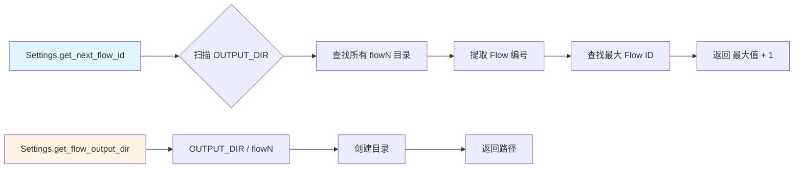
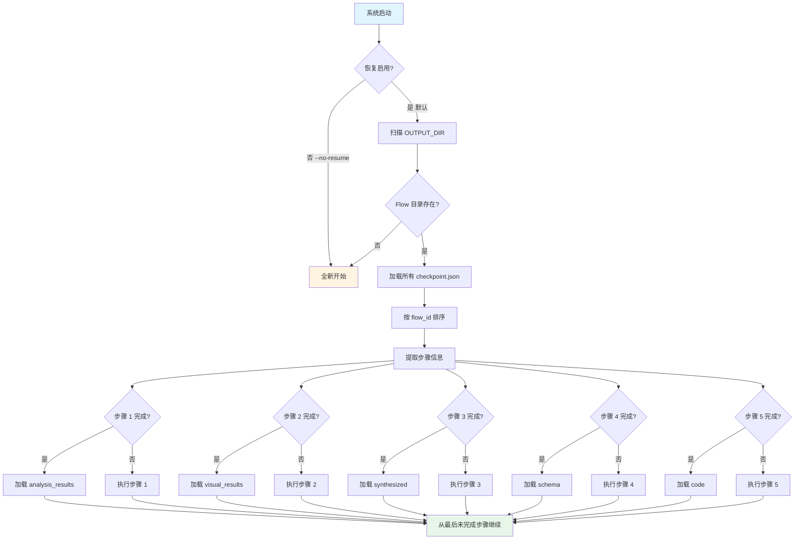

<div align="center">

# 🤖 crawlAgent

### 智能 HTML 抽取 Agent 系统

[](https://www.python.org/)
[](LICENSE)
[](https://openai.com/)
[](https://anthropic.com/)

**使用 AI 智能体自动解析 HTML、生成提取模式并产出生产就绪的代码。**

[功能特性](#-功能特性) • [快速开始](#-快速开始) • [系统架构](#-系统架构) • [使用文档](#-使用文档) • [示例](#-示例)

</div>

---

## 📖 项目概述

**crawlAgent** 是一个智能 HTML 抽取 Agent，使用专业 AI 智能体自动解析、理解并提取 HTML 文档中的结构化数据。无需手动编写 XPath 选择器或 CSS 查询，系统会智能分析 HTML 结构、识别内容模式，并生成生产就绪的提取代码。

### 🎯 核心优势

- **🧠 智能理解**：AI 智能体理解 HTML 语义，而不仅仅是语法
- **🔄 多智能体协作**：四个专业智能体无缝协同工作
- **📊 模式识别**：自动识别多个页面中的共同模式
- **🛠️ 生产就绪**：生成健壮、可维护的提取代码
- **⚡ 智能检查点**：从任何步骤恢复，永不丢失进度

---

## ✨ 功能特性

### 🤖 多智能体架构

| 智能体 | 功能 | 模型 |
|--------|------|------|
| **🔍 分析器智能体** | 深度文本 HTML 结构分析 | Claude Sonnet 4.5 (claude-sonnet-4-5-20250929) |
| **👁️ 视觉分析器** | 使用视觉模型分析布局 | Qwen-VL-Max (qwen-vl-max) |
| **🎯 协调器** | 综合结果并生成 JSON 模式（步骤 3 和 4） | GPT-5 (gpt5) |
| **💻 代码生成器** | 生成生产就绪的提取代码 | Claude Sonnet 4.5 (claude-sonnet-4-5-20250929) |
| **✅ 代码验证器** | 验证并改进代码质量 | Claude Sonnet 4.5 (claude-sonnet-4-5-20250929) |
| **📝 Markdown 转换器** | 将 JSON 结果转换为 Markdown 格式 | Claude Sonnet 4.5 (claude-sonnet-4-5-20250929) |

### 🧠 智能解析

- **多模态分析**：结合文本（LLM）和视觉（Vision）分析
- **自动 XPath 生成**：智能生成 XPath 表达式
- **模式推断**：从 HTML 结构创建 JSON 模式
- **模式识别**：识别多个文件中的共同模式

### ⚡ 自动化与效率

- **批量处理**：同时分析多个 HTML 文件
- **URL 下载**：自动从 URL 列表下载 HTML
- **检查点系统**：保存进度并从中断处恢复
- **分步结果**：查看每个步骤的中间结果

### 🛠️ 开发体验

- **美观日志**：彩色控制台输出和文件日志
- **自定义 API 端点**：支持 OpenAI 兼容的 API
- **错误恢复**：自动重试和回退机制
- **代码验证**：自动语法和鲁棒性检查

---

## 🚀 快速开始

### 安装

```bash
# 克隆仓库
git clone https://github.com/SHUzhangshuo/crawlAgent
cd crawlAgent

# 安装依赖
pip install -r requirements.txt

# 安装 Playwright 浏览器（用于视觉分析）
playwright install chromium
```

### 配置

1. **复制环境变量示例文件：**
   ```bash
   cp env.example .env
   ```

2. **编辑 `.env` 并添加你的 API 密钥：**
   ```env
   # OpenAI API（用于协调器和代码生成器）
   OPENAI_API_KEY=sk-your_api_key_here
   OPENAI_API_BASE=http://your-endpoint:port/v1
   OPENAI_MODEL=gpt-4o-mini

   # Anthropic API（用于分析器）
   ANTHROPIC_API_KEY=your_anthropic_api_key_here
   ANTHROPIC_BASE_URL=https://api.anthropic.com
   ANTHROPIC_MODEL=claude-3-5-sonnet-20241022

   # 视觉模型 API（用于视觉分析）
   VISION_API_KEY=sk-your_api_key_here
   VISION_MODEL=gpt-4o
   VISION_API_BASE=http://your-endpoint:port/v1
   ```

### 基本使用

```bash
# 使用默认配置（自动从 spread 目录读取，自动创建新的 flow 目录）
python main.py

# 使用 typical 目录（学习内容）
python main.py --input-type typical

# 处理指定的 URL 列表文件
python main.py urls.txt

# 处理指定的 HTML 目录
python main.py ./html_files

# 禁用视觉分析（更快）
python main.py --no-visual

# 指定流程编号（不使用自动递增）
python main.py --flow-id 1

# 指定自定义输出目录
python main.py --output-dir ./results
```

### 使用生成的代码

处理完成后，使用生成的提取代码：

```python
from output.extraction_code import HTMLExtractor
import json

# 创建提取器
extractor = HTMLExtractor()

# 从文件提取
result = extractor.extract(file_path="example.html")
print(json.dumps(result, indent=2, ensure_ascii=False))

# 从 HTML 字符串提取
html_string = "<html><body><h1>标题</h1></body></html>"
result = extractor.extract(html_content=html_string)

# 批量处理
from pathlib import Path
files = list(Path("html_files").glob("*.html"))
results = extractor.extract_batch(files, is_file_paths=True)
```

---

## 🏗️ 系统架构

### 多智能体工作流

系统使用复杂的多智能体流水线，每个智能体专注于特定任务：

```
┌─────────────────────────────────────────────────────────────┐
│                    HTML 输入（文件/URL）                      │
└───────────────────────────┬─────────────────────────────────┘
                             │
                             ▼
┌─────────────────────────────────────────────────────────────┐
  [智能体 1] 🔍 分析器智能体                                    │
│  ├─ 深度文本 HTML 结构分析                                     │
│  ├─ 智能 XPath 表达式生成                                     │
│  └─ 跨多个页面的模式识别                                       │
│  输出: flow1/checkpoint.json │                               │
└───────────────────────────┬─────────────────────────────────┘
                             │
                             ▼
┌─────────────────────────────────────────────────────────────┐
│  [智能体 2] 👁️ 视觉分析器（可选）                             │
│  ├─ 使用 Playwright 渲染 HTML                               │
│  ├─ 使用视觉模型进行布局分析                                  │
│  └─ 内容区域检测                                             │
│  输出: flow2/checkpoint.json                                │
└───────────────────────────┬─────────────────────────────────┘
                             │
                             ▼
┌─────────────────────────────────────────────────────────────┐
│  [步骤 3] 🎯 协调器 - 综合结果                                │
│  ├─ 综合所有先前智能体的结果                                  │
│  ├─ 识别文件间的共同模式                                      │
│  └─ 生成综合分析结果                                          │
│  输出: flow3/ (综合结果)                                     │
└───────────────────────────┬─────────────────────────────────┘
                             │
                             ▼
┌─────────────────────────────────────────────────────────────┐
│  [步骤 4] 🎯 协调器 - 生成模式                                │
│  ├─ 基于综合结果生成 JSON 模式                               │
│  ├─ 定义所有可提取字段的 XPath                               │
│  └─ 创建完整的提取模式定义                                   │
│  输出: flow4/extraction_schema.json                         │
└───────────────────────────┬─────────────────────────────────┘
                             │
                             ▼
┌─────────────────────────────────────────────────────────────┐
│  [智能体 4] 💻 代码生成器                                     │
│  ├─ 生成生产就绪的 Python 提取代码                           │
│  ├─ 实现健壮的错误处理                                       │
│  └─ 添加全面的文档                                           │
│  输出: flow5/extraction_code.py                             │
└───────────────────────────┬─────────────────────────────────┘
                             │
                             ▼
┌─────────────────────────────────────────────────────────────┐
│  [智能体 5] ✅ 代码验证器                                     │
│  ├─ 语法验证（AST 解析）                                     │
│  ├─ 鲁棒性检查（错误处理、None 检查）                        │
│  └─ AI 驱动的自动修复问题                                    │
│  输出: flow6/extraction_code.py (已验证)                    │
└───────────────────────────┬─────────────────────────────────┘
                             │
                             ▼
┌─────────────────────────────────────────────────────────────┐
│  [步骤 6.5] ⚙️ 代码执行                                      │
│  ├─ 在 spread 目录执行验证后的代码                           │
│  ├─ 处理所有 HTML 文件                                      │
│  └─ 生成独立的 JSON 结果                                    │
│  输出: flow6/extraction_results/                            │
└───────────────────────────┬─────────────────────────────────┘
                             │
                             ▼
┌─────────────────────────────────────────────────────────────┐
│  [智能体 6] 📝 Markdown 转换器                               │
│  ├─ 分析 JSON 结果中的内容字段                              │
│  ├─ 生成 Markdown 转换代码                                  │
│  └─ 将 JSON 转换为 Markdown 格式                            │
│  输出: flow7/markdown_output/                               │
└───────────────────────────┬─────────────────────────────────┘
                             │
                             ▼
┌─────────────────────────────────────────────────────────────┐
│         ✅ 生产就绪的代码 + 结果                              │
│  • 验证后的提取代码                                          │
│  • 完整的 JSON 模式                                          │
│  • 所有已处理文件的提取数据                                  │
│  • Markdown 格式的正文内容                                  │
└─────────────────────────────────────────────────────────────┘
```

### 处理步骤

1. **文本分析** → 分析器智能体分析 HTML 结构 → `flow1/`
2. **视觉分析** → 视觉分析器分析渲染布局（可选）→ `flow2/`
3. **协调** → 协调器综合所有结果 → `flow3/`
4. **模式生成** → 协调器生成 JSON 模式 → `flow4/`
5. **代码生成** → 代码生成器创建提取代码 → `flow5/`
6. **代码验证** → 代码验证器验证并改进代码 → `flow6/`
7. **代码执行** → 在 spread 目录执行验证后的代码 → `flow6/extraction_results/`
8. **Markdown 转换** → Markdown 转换器分析 JSON 并生成转换代码 → `flow7/`

---

## 📁 项目结构

```
crawlAgent/
├── agents/                  # AI 智能体实现
│   ├── orchestrator.py      # 协调器智能体
│   ├── analyzer.py          # 分析器智能体
│   ├── code_generator.py    # 代码生成器智能体
│   └── code_validator.py    # 代码验证器智能体
├── utils/                   # 工具模块
│   ├── html_parser.py       # HTML 解析工具
│   ├── visual_analyzer.py   # 视觉分析
│   ├── url_downloader.py    # URL 下载
│   ├── logger.py            # 日志系统
│   └── checkpoint.py        # 检查点管理
├── config/                  # 配置
│   └── settings.py          # 设置管理（包含路径配置）
├── prompts/                 # 提示模板
│   └── prompt_templates.py
├── data/                    # 数据目录
│   ├── input/               # 输入目录
│   │   ├── typcial/         # 学习内容目录
│   │   │   ├── urls.txt     # URL 列表（可选）
│   │   │   └── html/        # 已爬取的 HTML 文件（可选）
│   │   └── spread/          # 待处理内容目录
│   │       ├── urls.txt     # URL 列表（可选）
│   │       └── html/        # HTML 文件（可选）
│   └── output/              # 输出目录
│       ├── flow1/           # 流程1的输出
│       ├── flow2/           # 流程2的输出
│       └── ...              # 更多流程输出
├── logs/                    # 日志文件（已忽略）
├── main.py                  # 主入口点
├── requirements.txt         # 依赖项
├── env.example              # 环境变量模板
└── README_zh.md             # 本文件
```

---

## ⚙️ 配置说明

### 路径配置

项目的输入输出路径在 `config/settings.py` 中统一配置，支持灵活扩展。

#### 目录结构说明

```
data/
├── input/                    # 输入目录
│   ├── typcial/              # 学习内容目录（智能体需要学习的内容）
│   │   ├── urls.txt          # URL 列表文件（需要先爬取）
│   │   └── html/             # 已爬取好的 HTML 文件目录
│   └── spread/               # 待处理内容目录（智能体生成的代码需要处理的内容）
│       ├── urls.txt          # URL 列表文件
│       └── html/             # HTML 文件目录
└── output/                   # 输出目录（每次调用 API 的结果存储位置）
    ├── flow1/                # 流程1的输出目录
    ├── flow2/                # 流程2的输出目录
    └── ...                   # 更多流程输出目录
```

#### 输入方式

**typcial 目录（学习内容）**：
- **方式1**：放置 `urls.txt` 文件，系统会自动爬取 URL 列表中的网页
- **方式2**：直接在 `html/` 目录下放置已爬取好的 HTML 文件

**spread 目录（待处理内容）**：
- **方式1**：放置 `urls.txt` 文件，系统会处理 URL 列表中的网页
- **方式2**：直接在 `html/` 目录下放置需要处理的 HTML 文件

#### 输出方式

- 每次调用 API 的结果存储在 `data/output/` 目录下
- **自动创建 flow 目录**：每个步骤自动创建一个新的 flow 文件夹（`flow1/`、`flow2/`、`flow3/`、...）
  - 步骤 1（文本分析）→ `flow1/`
  - 步骤 2（视觉分析）→ `flow2/`
  - 步骤 3（综合）→ `flow3/`
  - 步骤 4（模式生成）→ `flow4/`
  - 步骤 5（代码生成）→ `flow5/`
  - 步骤 6（代码验证和修复）→ `flow6/`（包含 `extraction_results/` 文件夹，内有每个 HTML 文件的独立 JSON 文件）
  - 步骤 7（Markdown 转换）→ `flow7/`（包含 `markdown_output/` 文件夹，内有 Markdown 文件）
- 每个 flow 目录包含：
  - `checkpoint.json`：用于恢复的检查点数据
  - `step{N}_*_result.json`：步骤特定的结果文件
  - `intermediate_results.json`：该步骤的中间结果
  - `extraction_code.py`：生成的/验证后的提取代码（在 flow5/flow6 中）
  - `extraction_results/`：每个 HTML 文件的独立 JSON 结果文件（在 flow6 中）
  - `extraction_results_summary.json`：所有提取结果的汇总（在 flow6 中）
  - `markdown_converter.py`：生成的 Markdown 转换代码（在 flow7 中）
  - `markdown_output/`：每个 JSON 结果的独立 Markdown 文件（在 flow7 中）
  - `markdown_conversion_summary.json`：Markdown 转换结果汇总（在 flow7 中）
- 支持手动指定流程编号：使用 `--flow-id N` 指定特定的流程编号
- 第一次调用 API 的输入来自 `data/input/` 目录

### Flow 目录管理



**Flow ID 自动递增算法：**

```python
def get_next_flow_id():
    if not OUTPUT_DIR.exists():
        return 1
    
    existing_flows = []
    for item in OUTPUT_DIR.iterdir():
        if item.is_dir() and item.name.startswith('flow'):
            flow_num = int(item.name[4:])  # 从 'flow{N}' 提取数字
            existing_flows.append(flow_num)
    
    if not existing_flows:
        return 1
    
    return max(existing_flows) + 1
```

**Flow 目录结构：**

```
data/output/
├── flow1/                    # 步骤 1: 文本分析
│   ├── checkpoint.json       # 包含: step="text_analysis", analysis_results
│   └── step1_text_analysis_result.json
│
├── flow2/                    # 步骤 2: 视觉分析
│   ├── checkpoint.json       # 包含: step="visual_analysis", visual_results, analysis_results
│   └── step2_visual_analysis_result.json
│
├── flow3/                    # 步骤 3: 综合
│   ├── checkpoint.json       # 包含: step="synthesized", synthesized, analysis_results, visual_results
│   └── step3_synthesized_result.json
│
├── flow4/                    # 步骤 4: 模式生成
│   ├── checkpoint.json       # 包含: step="schema", schema, synthesized, ...
│   ├── extraction_schema.json
│   └── step4_schema_result.json
│
├── flow5/                    # 步骤 5: 代码生成
│   ├── checkpoint.json       # 包含: step="code_generated", code, schema, ...
│   ├── extraction_code.py    # 初始生成的代码
│   ├── intermediate_results.json
│   └── step5_code_result.json
│
├── flow6/                    # 步骤 6: 代码验证和执行
│   ├── checkpoint.json       # 包含: step="code_validated", code, validation, ...
│   ├── extraction_code.py    # 验证和修复后的代码（最终）
│   ├── code_validation_result.json
│   ├── extraction_results/   # 每个 HTML 的独立 JSON 文件
│   │   ├── page1.json
│   │   ├── page2.json
│   │   └── ...
│   ├── extraction_results_summary.json
│   └── intermediate_results.json
│
└── flow7/                    # 步骤 7: Markdown 转换
    ├── checkpoint.json       # 包含: step="markdown_converted", markdown_converter_code, ...
    ├── markdown_converter.py # 生成的 Markdown 转换代码
    ├── markdown_output/      # 每个 JSON 的独立 Markdown 文件
    │   ├── page1.md
    │   ├── page2.md
    │   └── ...
    ├── markdown_conversion_summary.json
    └── intermediate_results.json
```

### 配置文件使用

所有路径配置都在 `config/settings.py` 中：

```python
from config import Settings

# 获取路径配置
Settings.initialize_directories()  # 初始化并创建所有必需的目录

# 访问路径
typical_urls = Settings.TYPICAL_URLS_FILE      # data/input/typcial/urls.txt
typical_html = Settings.TYPICAL_HTML_DIR       # data/input/typcial/html/
spread_urls = Settings.SPREAD_URLS_FILE        # data/input/spread/urls.txt
spread_html = Settings.SPREAD_HTML_DIR         # data/input/spread/html/
output_dir = Settings.OUTPUT_DIR               # data/output/

# 获取流程输出目录
flow1_output = Settings.get_flow_output_dir(1)  # data/output/flow1/
flow2_output = Settings.get_flow_output_dir(2)  # data/output/flow2/

# 自动获取下一个可用的流程编号和目录
next_flow_id = Settings.get_next_flow_id()  # 自动递增，返回下一个可用的编号
next_flow_dir = Settings.get_next_flow_output_dir()  # 自动创建新的 flow 目录
```

### 环境变量配置

可以通过环境变量自定义路径：

```env
# 自定义数据目录（可选，默认为项目根目录下的 data/）
DATA_DIR=D:/data/custom_data

# 自定义输出目录（可选，默认为 DATA_DIR/output）
OUTPUT_DIR=D:/data/custom_output
```

### 流程管理

#### 自动递增流程编号（推荐）

**默认行为**：每次执行智能体时，系统会自动创建新的 flow 文件夹，无需手动指定编号。

```bash
# 第一次执行 - 自动创建 flow1
python main.py

# 第二次执行 - 自动创建 flow2
python main.py

# 第三次执行 - 自动创建 flow3
python main.py
```

#### 手动指定流程编号

如果需要使用特定的流程编号：

```bash
# 使用 flow1
python main.py --flow-id 1

# 使用 flow5
python main.py --flow-id 5

# 禁用自动递增，强制使用 flow1
python main.py --no-auto-flow
```

#### 编程方式管理流程

```python
from config import Settings

# 方式1：手动指定流程编号
flow3_output = Settings.get_flow_output_dir(3)  # data/output/flow3/

# 方式2：自动获取下一个可用的流程编号（推荐）
next_flow_id = Settings.get_next_flow_id()  # 自动递增
next_flow_dir = Settings.get_next_flow_output_dir()  # 自动创建新目录
```

### 扩展新流程

当需要添加新流程时，只需：

1. **自动递增**：系统默认会自动创建新的 flow 目录，无需手动管理
2. **自定义输入源**：可以在 `config/settings.py` 中添加新的输入目录配置
   ```python
   # 在 Settings 类中添加
   CUSTOM_INPUT_DIR = INPUT_DIR / 'custom'
   CUSTOM_HTML_DIR = CUSTOM_INPUT_DIR / 'html'
   ```

3. **目录自动创建**：调用 `Settings.initialize_directories()` 会自动创建所有配置的目录

### 路径信息查看

查看所有路径配置信息：

```python
from config import Settings

path_info = Settings.get_path_info()
print(path_info)
# 输出：
# {
#     'project_root': 'D:/data/cursorworkspace/crawlAgent',
#     'data_dir': 'D:/data/cursorworkspace/crawlAgent/data',
#     'input_dir': 'D:/data/cursorworkspace/crawlAgent/data/input',
#     'typical_dir': 'D:/data/cursorworkspace/crawlAgent/data/input/typcial',
#     ...
# }
```

---

## 📊 输出文件

### 主要输出

- **`extraction_schema.json`**：包含 XPath 表达式的 JSON 模式
- **`extraction_code.py`**：生产就绪的 Python 提取代码
- **`code_validation_result.json`**：代码验证报告

### 分步骤输出文件

| 步骤 | Flow 目录 | 主要输出文件 |
|------|----------|-------------|
| **步骤 1** | `flow1/` | `step1_text_analysis_result.json`, `checkpoint.json`, `intermediate_results.json` |
| **步骤 2** | `flow2/` | `step2_visual_analysis_result.json`, `checkpoint.json`, `intermediate_results.json` |
| **步骤 3** | `flow3/` | `step3_synthesized_result.json`, `checkpoint.json`, `intermediate_results.json` |
| **步骤 4** | `flow4/` | `extraction_schema.json`, `step4_schema_result.json`, `checkpoint.json`, `intermediate_results.json` |
| **步骤 5** | `flow5/` | `extraction_code.py` (初始代码), `checkpoint.json`, `intermediate_results.json` |
| **步骤 6** | `flow6/` | `extraction_code.py` (验证后), `code_validation_result.json`, `checkpoint.json`, `intermediate_results.json` |
| **步骤 6.5** | `flow6/extraction_results/` | `page1.json`, `page2.json`, ... (独立结果), `extraction_results_summary.json` (在 flow6/) |
| **步骤 7** | `flow7/` | `markdown_converter.py`, `markdown_output/`, `markdown_conversion_summary.json`, `checkpoint.json`, `intermediate_results.json` |

#### 文件详细说明

- **`extraction_schema.json`** (flow4/): 完整的 JSON 模式，包含所有可提取部分的 XPath 表达式
- **`extraction_code.py`** (flow5/): 初始生成的 Python 提取代码
- **`extraction_code.py`** (flow6/): 验证和改进后的 Python 提取代码（生产就绪）
- **`code_validation_result.json`** (flow6/): 详细的验证报告，包含语法错误、鲁棒性问题和应用的修复
- **`extraction_results/`** (flow6/): 包含每个已处理 HTML 文件的独立 JSON 文件目录
  - 每个文件以源 HTML 命名（如 `page1.json`, `article.html.json`）
  - 包含根据模式提取的结构化数据
- **`extraction_results_summary.json`** (flow6/): 汇总文件，列出所有已处理的文件及其结果文件路径
- **`markdown_converter.py`** (flow7/): 生成的用于将 JSON 结果转换为 Markdown 格式的 Python 代码
- **`markdown_output/`** (flow7/): 包含每个 JSON 结果的独立 Markdown 文件目录
  - 每个文件以源 JSON 命名（如 `page1.md`, `article.json.md`）
  - 包含从 JSON 提取的 Markdown 格式内容
- **`markdown_conversion_summary.json`** (flow7/): 汇总文件，列出所有已转换的 Markdown 文件及其路径
- **`checkpoint.json`** (每个 flow/): 该步骤的完整处理状态，支持自动恢复
- **`intermediate_results.json`** (每个 flow/): 用于调试和审查的中间处理结果

### 检查点系统

检查点系统确保您永远不会丢失进度：

- **`checkpoint.json`**: 存储在每个 flow 目录中，包含该步骤的完整处理状态和所有数据
- **自动恢复**: 系统在启动时自动扫描所有 flow 目录，加载检查点，并从最后一个完成的步骤恢复
- **每步独立检查点**: 每个步骤（flow1-flow6）独立维护自己的检查点
- **智能恢复**: 恢复时，系统从最新检查点加载所有先前步骤的数据
- **无需手动干预**: 检查点恢复是自动的 - 无需查看日志或手动指定恢复点

---

## 🔧 高级用法

### 命令行选项

```bash
# 自动创建新的 flow 目录（默认行为）
python main.py

# 从上次检查点恢复（默认自动启用）
python main.py

# 强制重新开始，忽略检查点
python main.py --no-resume

# 指定流程编号（不使用自动递增）
python main.py --flow-id 2

# 禁用自动递增，使用默认 flow1
python main.py --no-auto-flow

# 自定义输出目录
python main.py --output-dir ./custom_output

# 禁用视觉分析（更快）
python main.py --no-visual

# 使用 typical 目录（学习内容）
python main.py --input-type typical
```

### 输入格式

**1. HTML 文件目录：**
```bash
python main.py ./html_files
```

**2. URL 列表文件：**
```bash
python main.py urls.txt
```

示例 `urls.txt`：
```
# 以 # 开头的行是注释
https://example.com/page1.html
https://example.com/page2.html
https://example.com/page3.html
```

### 自定义 API 端点

系统支持自定义 OpenAI 兼容的 API 端点：

```env
OPENAI_API_BASE=http://your-custom-endpoint:port/v1
ANTHROPIC_BASE_URL=http://your-custom-endpoint:port/v1
```

**注意**：URL 将完全按照配置使用，不会进行任何修改。

---

## 🔬 实现细节

### CheckpointManager 类

`CheckpointManager` 类处理所有检查点操作：

```python
class CheckpointManager:
    """管理检查点以恢复中断的处理"""
    
    CHECKPOINT_FILE = "checkpoint.json"
    
    def __init__(self, output_dir: Path):
        self.output_dir = Path(output_dir)
        self.checkpoint_path = self.output_dir / self.CHECKPOINT_FILE
    
    def save_checkpoint(self, step: str, data: Dict[str, Any]):
        """保存检查点，包含步骤名称和数据"""
        checkpoint = {
            "step": step,
            "timestamp": datetime.now().isoformat(),
            "data": data
        }
        # 保存到 checkpoint.json
    
    def load_checkpoint(self) -> Optional[Dict[str, Any]]:
        """从文件加载检查点"""
        # 返回检查点字典或 None
```

### 设置配置系统

在 `config/settings.py` 中集中管理路径：

```python
class Settings:
    # 基础目录
    PROJECT_ROOT = Path(__file__).parent.parent
    DATA_DIR = PROJECT_ROOT / 'data'
    INPUT_DIR = DATA_DIR / 'input'
    OUTPUT_DIR = DATA_DIR / 'output'
    
    # 输入目录
    TYPICAL_DIR = INPUT_DIR / 'typcial'
    TYPICAL_HTML_DIR = TYPICAL_DIR / 'html'
    TYPICAL_URLS_FILE = TYPICAL_DIR / 'urls.txt'
    
    SPREAD_DIR = INPUT_DIR / 'spread'
    SPREAD_HTML_DIR = SPREAD_DIR / 'html'
    SPREAD_URLS_FILE = SPREAD_DIR / 'urls.txt'
    
    @classmethod
    def get_flow_output_dir(cls, flow_id: int) -> Path:
        """获取特定流程的输出目录"""
        return cls.OUTPUT_DIR / f'flow{flow_id}'
    
    @classmethod
    def get_next_flow_id(cls) -> int:
        """自动递增流程 ID"""
        # 扫描现有 flow 目录
        # 返回 max(flow_ids) + 1
```

### 代码执行机制

系统动态导入并执行生成的代码：

```python
def _execute_extraction_code(code_path, output_dir, json_schema):
    # 1. 动态加载代码模块
    spec = importlib.util.spec_from_file_location("extraction_code", code_path)
    module = importlib.util.module_from_spec(spec)
    spec.loader.exec_module(module)
    
    # 2. 查找提取器类/函数
    extractor = module.HTMLExtractor()
    
    # 3. 处理每个 HTML 文件
    for html_file in html_files:
        result = extractor.extract(html_content=html_content)
        
        # 4. 保存独立 JSON 文件
        json_filename = f"{html_filename}.json"
        save_to_extraction_results(json_filename, result)
    
    # 5. 生成汇总
    save_summary(extraction_results_summary.json)
```

### 智能体提示工程

每个智能体使用专门的提示：

1. **分析器智能体**：专注于 HTML 结构、XPath 生成
2. **视觉分析器**：分析渲染布局、视觉模式
3. **协调器**：综合结果、识别共同模式
4. **代码生成器**：生成生产就绪的 Python 代码
5. **代码验证器**：验证语法、检查鲁棒性、建议修复
6. **Markdown 转换器**：分析 JSON 内容字段，生成 Markdown 转换代码

提示存储在 `prompts/prompt_templates.py` 中，可以自定义。

---

## 📝 示例

### 示例 1：从单个 HTML 文件提取

```python
from output.extraction_code import HTMLExtractor
import json

extractor = HTMLExtractor()
result = extractor.extract(file_path="article.html")

print(f"标题: {result.get('article_title')}")
print(f"日期: {result.get('article_date')}")
print(f"正文: {result.get('article_body')[:100]}...")
```

### 示例 2：批量处理

```python
from pathlib import Path
from output.extraction_code import HTMLExtractor

extractor = HTMLExtractor()
html_files = list(Path("html_files").glob("*.html"))

results = extractor.extract_batch(html_files, is_file_paths=True)

for file_path, result in zip(html_files, results):
    print(f"{file_path.name}: {result.get('article_title', 'N/A')}")
```

### 示例 3：保存结果到 JSON

```python
from output.extraction_code import HTMLExtractor
import json

extractor = HTMLExtractor()
result = extractor.extract(file_path="article.html")

with open("extracted_data.json", "w", encoding="utf-8") as f:
    json.dump(result, f, indent=2, ensure_ascii=False)
```

---

## 🔍 JSON 模式格式

生成的模式遵循以下结构：

```json
{
  "schema_version": "1.0",
  "description": "从 HTML 页面提取内容的模式",
  "sections": [
    {
      "name": "article_title",
      "description": "文章主标题",
      "xpath": "//h1[@class='title']",
      "is_list": false,
      "attributes": {},
      "notes": "提取主标题"
    },
    {
      "name": "comments",
      "description": "评论列表",
      "xpath": "//div[@class='comment']",
      "xpath_list": ["//div[@class='comment']"],
      "is_list": true,
      "attributes": {"class": "comment"}
    }
  ]
}
```

---

## 🛡️ 检查点与恢复系统

系统在每个步骤后自动保存检查点，**默认自动从检查点恢复**，确保您永远不会丢失进度。

### 核心特性

- ✅ **自动恢复（默认）**：系统启动时自动检查检查点，从最后一个完成的步骤恢复
- ✅ **无需查看日志**：检查点恢复是自动的，无需查看日志即可知道从哪里恢复
- ✅ **每步独立检查点**：每个步骤（flow1、flow2、flow3 等）都有自己的 `checkpoint.json` 文件
- ✅ **智能恢复**：系统扫描所有 flow 目录，加载检查点，自动跳过已完成的步骤
- ✅ **手动控制**：使用 `--no-resume` 标志强制重新开始，忽略检查点
- ✅ **步骤结果**：每个步骤在各自的 flow 目录中单独保存结果
- ✅ **进度跟踪**：永不丢失进度，自动从任何步骤恢复

### 工作原理

1. **检查点创建**：每个步骤完成后，在该步骤的 flow 目录中保存 `checkpoint.json` 文件
2. **启动扫描**：系统启动时，扫描输出文件夹中的所有 `flow{N}/` 目录
3. **检查点加载**：对于每个 flow 目录，加载 `checkpoint.json` 文件并提取：
   - 步骤名称（如 `"text_analysis"`, `"code_validated"`）
   - 所有处理数据（分析结果、模式、代码等）
4. **状态恢复**：系统从最新检查点恢复完整状态
5. **智能跳过**：已完成的步骤（有有效检查点）自动跳过
6. **恢复执行**：处理从第一个未完成的步骤继续

### 检查点恢复流程



### 检查点数据结构

每个 `checkpoint.json` 文件包含：

```json
{
  "step": "text_analysis|visual_analysis|synthesized|schema|code",
  "timestamp": "2025-12-09T14:17:15.123456",
  "data": {
    "analysis_results": [...],      // 步骤 1 数据
    "visual_results": [...],        // 步骤 2 数据（如果启用视觉分析）
    "synthesized": {...},           // 步骤 3 数据
    "schema": {...},                // 步骤 4 数据
    "code": "...",                  // 步骤 5 数据
    "file_identifiers": [...],     // 输入文件列表
    "validation": {...}             // 代码验证结果（步骤 5）
  },
  "metadata": {
    // 附加元数据
  }
}
```

### 检查点恢复算法

```python
# 检查点恢复伪代码
def recover_from_checkpoints():
    existing_flows = []
    
    # 扫描所有 flow 目录
    for flow_dir in OUTPUT_DIR:
        if flow_dir.name.startswith('flow'):
            checkpoint = load_checkpoint(flow_dir)
            if checkpoint:
                existing_flows.append({
                    'flow_id': extract_flow_id(flow_dir),
                    'checkpoint': checkpoint,
                    'step': checkpoint['step']
                })
    
    # 按 flow_id 排序
    existing_flows.sort(key=lambda x: x['flow_id'])
    
    # 从检查点加载数据（后续步骤包含所有先前数据）
    for flow_info in existing_flows:
        step = flow_info['checkpoint']['step']
        data = flow_info['checkpoint']['data']
        
        if step == "code":
            # 最新检查点包含所有数据
            analysis_results = data.get('analysis_results')
            visual_results = data.get('visual_results')
            synthesized = data.get('synthesized')
            json_schema = data.get('schema')
            extraction_code = data.get('code')
    
    # 跳过已完成的步骤，从最后未完成的步骤继续
    return restored_state
```

---

## 📋 系统要求

- **Python**：3.8 或更高版本
- **API 密钥**：
  - OpenAI API 密钥（或兼容端点）
  - Anthropic API 密钥（或兼容端点）
- **依赖项**：参见 `requirements.txt`
- **可选**：Playwright 用于视觉分析

---

## 🤝 贡献

欢迎贡献！请随时提交 Pull Request。

1. Fork 本仓库
2. 创建你的功能分支 (`git checkout -b feature/AmazingFeature`)
3. 提交你的更改 (`git commit -m 'Add some AmazingFeature'`)
4. 推送到分支 (`git push origin feature/AmazingFeature`)
5. 打开 Pull Request

---

## 📄 许可证

本项目采用 MIT 许可证 - 查看 [LICENSE](LICENSE) 文件了解详情。

---

## 🙏 致谢

- 使用 [OpenAI](https://openai.com/) 和 [Anthropic](https://anthropic.com/) API 构建
- 使用 [lxml](https://lxml.de/) 进行 HTML 解析
- 使用 [Playwright](https://playwright.dev/) 进行视觉分析

---

## 📞 支持

- **问题反馈**：[GitHub Issues](https://github.com/SHUzhangshuo/crawlAgent/issues)
- **讨论交流**：[GitHub Discussions](https://github.com/SHUzhangshuo/crawlAgent/discussions)

---

<div align="center">

**使用 AI 智能体 ❤️ 制作**

⭐ 如果觉得有用，请给个 Star！

</div>
